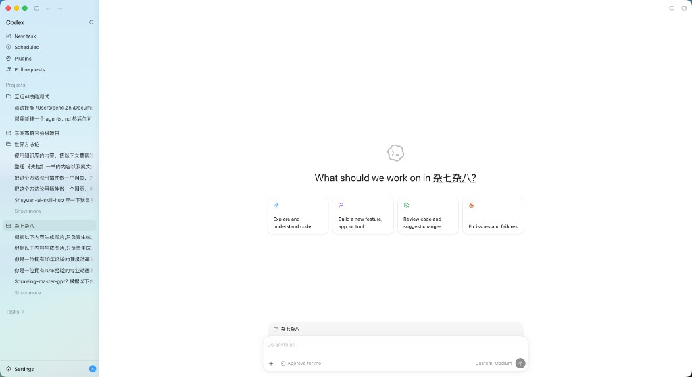
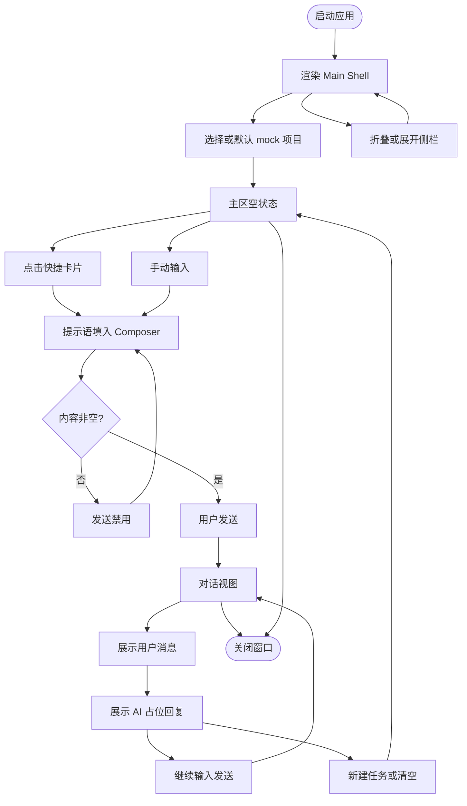
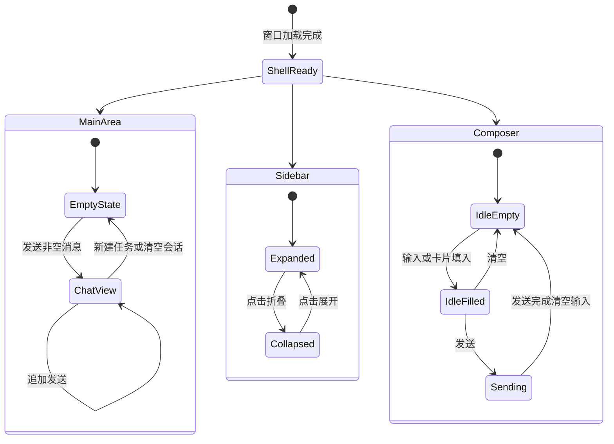

# PRD: HookBuddy 主界面 Shell

| 属性 | 值 |
|------|-----|
| 状态 | backlog |
| 范围 | Renderer 主 Shell UI（排版与交互骨架）；不含 Agent 执行与真实项目接入 |
| 关联文档 | `AGENTS.md`、`docs/MAC Windows 选型技术文档.md`、`docs/doc_index.md` |
| 参考视觉 | [assets/codex-main-shell-reference.png](assets/codex-main-shell-reference.png)（Codex 桌面端主界面） |

## 参考视觉（开发必看）

实现时以本图为**布局与分区**基准（信息架构、左右分栏、空状态卡片、底部 Composer、侧栏图标与密度）；文案按本 PRD 使用中文，不要求像素级复刻。

**图中分区对照（便于拆组件）**

| 区域 | 图中内容 | 本 PRD 对应 |
|------|----------|-------------|
| 标题栏 | 交通灯、侧栏折叠、前进/后退 | §6.1 |
| 左侧栏 | 品牌、搜索、导航四项、Projects 展开列表、Settings | §6.2 |
| 主区空状态 | Logo、标题、四张快捷卡片 | §6.3 |
| 底部输入区 | 项目 chip、Do anything、+ / Approve / 模型 / 发送 | §6.5 |

## 1. 背景与问题

HookBuddy 已具备 Electron + React 19 + Tailwind v4 + shadcn/ui 工程底座，但 Renderer 仍为脚手架默认页，缺少可承载 AI 编码助手能力的**产品级主界面**。

团队目标是做一款 Codex 风格的 AI 桌面客户端。用户打开应用后，应立刻看到：

1. **左侧**：导航与项目/任务浏览；
2. **右侧**：当前项目上下文下的工作区（空状态欢迎 + 快捷意图卡片）；
3. **底部**：悬浮聊天输入框，可发起任务。

本期优先解决「**主功能界面排版与视觉骨架**」问题：图标、分区、状态切换与占位交互对齐上方参考图；真实 Agent、目录选择、账号等能力延后。

## 2. 目标与非目标

### 2.1 目标（Release 0）

- 交付对标 Codex 的**左右分栏主 Shell**（可折叠侧栏 + 主工作区 + 底部输入区）。
- 中文文案；lucide 图标；浅色 + 深色主题（跟随系统，基于 shadcn/Tailwind 主题变量）。
- 使用 **mock 数据** 演示：项目列表、历史任务、展开/折叠、「显示更多」、选中高亮。
- 主区空状态：动态标题「想在 {项目名} 做点什么？」+ 4 张快捷操作卡片（点击填入输入框）。
- 发送消息后进入**简单对话视图**：回显用户消息 + AI 占位回复；可返回空状态。
- 输入框完整工具栏占位：`+`、审批模式、模型/推理力度、发送（空内容禁用）。

### 2.2 非目标

- Agent 真实执行 / 流式日志 / 工具调用。
- 真实本地项目目录选择（IPC `dialog`）——属 Release 1 可选。
- 账号登录、云同步、多租户。
- 「定时任务 / 插件 / Pull Requests」真实功能（仅导航入口与选中态）。
- 侧栏全局搜索真实过滤（Release 1）。
- 完整 Windows 自定义标题栏像素级适配（Release 1 增强）。

## 3. 术语

| 术语 | 含义 |
|------|------|
| Main Shell | 应用主窗口内固定骨架：标题栏区 + 侧栏 + 主区 + 底部输入区 |
| 项目（Project） | 侧栏「项目」分组中的条目；本期为 mock，语义上对应一个本地工作区 |
| 历史任务 | 项目展开后的子列表项；本期 mock，点击可切换主区上下文（占位） |
| 空状态（Empty State） | 主区未进入对话时的欢迎页：Logo + 标题 + 4 快捷卡片 |
| 对话视图（Chat View） | 发送后展示消息气泡列表的主区视图 |
| 审批模式 | 输入区「代我审批」类开关/下拉；本期 UI 占位，无真实权限逻辑 |
| 模型/推理力度 | 如「Custom Medium」；本期下拉占位 |

## 4. 已拍板规则 / 取舍

| 决策项 | 结论 | 备注 |
|--------|------|------|
| 本期范围 | 纯静态排版 + mock 数据 | 不接真实目录与 Agent |
| 发送行为 | 切换到简单对话视图：用户消息回显 + AI 占位回复 | 文案示例：「功能开发中，真实 Agent 能力将在后续版本提供。」 |
| 文案语言 | 中文 | 关键文案见 §6 |
| 主题 | 浅色 + 深色，跟随系统 | `prefers-color-scheme` 或既有主题变量 |
| 功能 slug | `main-shell-ui` | 文件 `prd-00001-main-shell-ui.md` |
| 图标库 | lucide（与 AGENTS.md / shadcn 预设一致） | 禁止随意混用其他图标集 |
| 导航项真实能力 | 不做 | 仅入口与高亮 |
| 快捷卡片点击 | 将对应提示语填入输入框，**不自动发送** | 用户可编辑后再发送 |

## 5. 用户与角色

| 角色 | 目标 |
|------|------|
| 开发者用户（主） | 打开应用即可识别「选项目 → 输入意图 → 发任务」路径 |
| 前端工程师 | 按分区规格拆组件，图标与状态有明确验收标准 |
| 产品/工程验收官 | 对照本 PRD 与参考截图逐区验收 |

## 6. 功能域

实现落点约定（与 `AGENTS.md` 对齐）：

- UI：`src/renderer/src/`，可复用 `@/components/ui`（button、card 等）
- 样式/主题：`src/renderer/src/assets/main.css`
- 本期**不新增** Main/Preload IPC（静态 mock）

### 6.1 窗口与标题栏区

| 元素 | 规格 |
|------|------|
| 窗口 | Electron 无边框（`titleBarStyle` / `trafficLightPosition` 等以现有选型文档为准）；macOS 保留系统交通灯 |
| 侧栏折叠 | 标题栏左侧（交通灯右侧）提供折叠/展开图标按钮 |
| 前进/后退 | 图标占位，本期点击无历史栈逻辑（可 `disabled` 或 toast「功能开发中」） |
| 右上角 | 可选布局相关图标占位（对齐参考图视觉密度即可） |

### 6.2 左侧栏（Sidebar）

| 区块 | 规格 |
|------|------|
| 宽度 | 展开约 **260px**；收起后主区占满；须保留标题栏折叠按钮作为唯一展开入口 |
| 背景 | 浅色：浅灰/淡蓝灰；深色：对应 surface 变量 |
| 品牌区 | 顶部产品名「HookBuddy」（或阶段性「Codex 风格」占位名，以实现时品牌文案为准）+ 右侧搜索图标（R0 点击可空操作或 toast） |
| 导航组 | 四项，均带 lucide 图标与中文标签：新建任务、定时任务、插件、Pull Requests |
| 项目分组 | 标题「项目」；列表项 = 文件夹图标 + 名称；可展开/折叠；子项为历史任务（缩进、单行截断、hover 显示完整名）；默认每项目最多展示 N 条（建议 **5**），超出显示「显示更多」；当前项目高亮 |
| 任务分组 | 标题「任务」+ 折叠箭头；R0 可为空列表或 1–2 条 mock |
| 底部 | 「设置」齿轮图标；右侧可放圆形徽标占位（更新/头像类视觉，无逻辑） |

**导航项图标建议（lucide）**

| 文案 | 建议图标 |
|------|----------|
| 新建任务 | `SquarePen` / `PenLine` |
| 定时任务 | `Clock` |
| 插件 | `Puzzle` 或 `AtSign`（对齐参考图观感即可，全仓统一一种） |
| Pull Requests | `GitPullRequest` |
| 搜索 | `Search` |
| 设置 | `Settings` |
| 项目 | `Folder` |
| 侧栏折叠 | `PanelLeft` / `PanelLeftClose` |

### 6.3 主区 — 空状态

| 元素 | 规格 |
|------|------|
| Logo | 居中；可用简洁插画/图标（云朵+代码感），不强制像素复刻 |
| 标题 | 「想在 **{当前项目名}** 做点什么？」 |
| 快捷卡片 | 横向 4 张（窄屏可 2×2）；白底圆角卡片 + 彩色小图标 + 文案 |

| 卡片文案 | 建议图标色调 | 填入输入框的提示语（示例） |
|----------|--------------|---------------------------|
| 探索并理解代码 | 蓝/紫 sparkles | 「帮我探索并理解这个项目的代码结构」 |
| 构建新功能、应用或工具 | 橙 hammer | 「帮我构建一个新功能：」 |
| 审查代码并提出修改建议 | 绿 refresh | 「请审查相关代码并给出修改建议」 |
| 修复问题与失败 | 红 bug | 「帮我排查并修复以下问题：」 |

### 6.4 主区 — 对话视图

- 发送后：主区从空状态切换为消息列表。
- 用户消息：右对齐气泡，展示原文。
- AI 回复：左对齐气泡，固定占位文案（可带轻微「正在输入」动画，非必须）。
- 支持「新建任务」或清空会话类入口返回空状态（侧栏「新建任务」或对话区顶部操作，二选一须在实现时固定并写进验收）。
- 多轮：同一会话内继续发送可追加气泡（仍为占位 AI 回复）。

### 6.5 底部输入区（Composer）

悬浮于主区底部居中，圆角卡片，结构自上而下：

1. **上下文条**：文件夹图标 + 当前项目名 chip（点击可切换 mock 项目列表，可选；至少只读展示）。
2. **文本区**：placeholder「随便写点什么」或「开始输入…」；多行自适应增高，建议最大高度约 **120–160px**，超出内部滚动。
3. **工具栏**：
   - 左：`+`（附件占位）；「代我审批」类控件（图标 + 文案，下拉占位）。
   - 右：模型/推理力度文案（如「自定义 · 中等」）+ 圆形发送按钮（`ArrowUp`）。
4. **发送**：Enter 发送；Shift+Enter 换行（建议）；内容 trim 为空时发送按钮 `disabled`。

### 6.6 交互与视觉状态

- hover / active / selected：侧栏项、卡片、按钮均需可区分。
- 无项目 mock 时：项目区展示空状态文案「暂无项目」。
- 超长名称：`truncate` + `title` tooltip。
- 最小窗口宽度：侧栏可强制收起或卡片改为 2 列，避免横向溢出。

### 6.7 主题

- 浅色对齐参考截图观感（白主区 + 浅侧栏）。
- 深色：同一组件树，使用 CSS 变量切换；对比度满足可读。
- 跟随系统：监听 `prefers-color-scheme`（若已有 theme provider 则复用）。

## 7. 用户故事地图与版本切片

### 7.1 旅程主干

| 步骤 | 节点 | 说明 |
|------|------|------|
| Entry | 启动应用 | 打开主窗口，进入 Main Shell |
| 1 | 浏览侧栏 | 看到导航、项目 mock、设置 |
| 2 | 选择/展开项目 | 高亮当前项目，展开历史任务 |
| 3 | 查看空状态 | 标题随项目名变化，见 4 张卡片 |
| 4 | 使用快捷卡片或手输 | 内容进入 Composer |
| 5 | 发送 | 进入对话视图，见用户气泡 + AI 占位 |
| 6 | 继续对话或新建 | 追加消息或返回空状态 |
| 7 | 折叠侧栏 | 主区加宽；再展开恢复 |
| Exit | 关闭窗口 | 会话状态可不持久化（R0 内存即可） |

### 7.2 用户故事地图

**阶段 A — 进入与布局**

| 故事 | 验收要点 |
|------|----------|
| 作为用户，我想要打开应用即看到左右分栏主界面，以便确认产品形态 | 侧栏 + 主区 + 底部输入区同时可见；无脚手架默认 Versions 页作为主页 |
| 作为用户，我想要折叠/展开侧栏，以便专注主区 | 折叠后侧栏不可见或仅图标轨；标题栏按钮可再次展开 |
| 作为用户，我想要浅色/深色随系统切换，以便在不同环境下舒适使用 | 切换系统外观后 UI 主题同步变化 |

**阶段 B — 项目与导航**

| 故事 | 验收要点 |
|------|----------|
| 作为用户，我想要在侧栏浏览 mock 项目与历史任务，以便理解信息架构 | ≥2 个 mock 项目；至少 1 个可展开且含任务子项；「显示更多」在超限时出现 |
| 作为用户，我想要点选项目后看到主区标题更新，以便确认上下文 | 标题含当前项目名 |
| 作为用户，我想要点击「新建任务/定时任务/插件/PR/设置」有明确反馈，以便知道入口已预留 | 导航选中高亮；无真实页时可 toast 或占位面板 |

**阶段 C — 发起任务**

| 故事 | 验收要点 |
|------|----------|
| 作为用户，我想要点击快捷卡片自动填入提示语，以便快速开场 | 输入框出现对应文案且未自动发送 |
| 作为用户，我想要在输入框编辑并发送消息，以便进入对话视图 | 非空可发送；主区切换；用户气泡内容正确 |
| 作为用户，我想要看到 AI 占位回复，以便知道闭环未断 | 发送后出现 AI 气泡占位文案 |
| 作为用户，我想要空输入时无法误发，以便减少误操作 | 发送按钮 disabled |

### 7.3 Release 切片

#### Release 0（MVP，必选）

- Main Shell 左右分栏 + 可折叠侧栏 + 标题栏折叠控件。
- 侧栏：品牌、搜索图标、四导航、项目 mock（展开/截断/显示更多/高亮）、任务分组占位、设置。
- 主区空状态 + 4 快捷卡片。
- Composer 完整工具栏占位 + 多行输入 + 发送校验。
- 对话视图（用户回显 + AI 占位）+ 返回空状态路径。
- 中文文案；lucide；浅/深色跟随系统。

**可验收结果**：对照本 PRD §6 与故事验收要点，在 `pnpm dev` 下可完整走通「选项目 → 填词/点卡片 → 发送 → 见对话 → 折叠侧栏」闭环。

#### Release 1（可选，同 PRD）

- 侧栏搜索过滤 mock 项目/任务。
- 真实「打开文件夹」选项目（经 Preload IPC，遵守 contextIsolation）。
- Windows 标题栏/拖拽区适配增强。

**本期不做（禁止 Release 2 占位）**：见 §2.2；溢出能力另立 PRD。

## 8. 核心流程与状态机图

### 8.1 主业务流程图

### 8.2 核心对象状态图

**断头路预警**

- 侧栏收起后若无展开入口 → 禁止；必须保留标题栏折叠按钮。
- 发送后若无任何 UI 变化 → 禁止；必须进入对话视图并展示双气泡。
- 「显示更多」点击后无展开更多 mock → R0 至少展开剩余项或 toast，禁止无响应。

## 9. 数据与 API 衔接

| 项 | R0 | R1 |
|----|----|----|
| 项目/任务数据 | Renderer 内 mock 常量/本地 state | 可选：用户选择目录后写入本地偏好 |
| 消息 | 内存数组，不落盘 | 可另立 PRD |
| IPC | 无新增 | `dialog.showOpenDialog` 等经 Preload 白名单 |

## 10. 成功标准（可度量）

1. 主路径 8 步旅程可在演示中无讲解走通。
2. 对照 §6 分区清单，缺失区块 = 0。
3. 空输入发送成功率 = 0（按钮禁用）。
4. 系统浅/深切换后，主 Shell 无不可读对比度区块。
5. `pnpm typecheck` 通过（实现阶段）。

## 11. 假设与待确认 / 开放项

| 编号 | 内容 | 状态 |
|------|------|------|
| O1 | 产品顶栏品牌文案最终用「HookBuddy」还是其他中文名 | 待确认（R0 可用 HookBuddy） |
| O2 | 对话返回空状态的入口位置（侧栏「新建任务」vs 主区按钮） | 实现时固定一种 |
| O3 | mock 项目名称是否使用截图同款中文样例 | 建议使用，便于对照 |
| O4 | Windows 下 traffic light 不适用时的拖拽区高度 | R1 |
| O5 | 会话是否需要 localStorage 持久化 | 默认否，进开放项 |

## 12. 风险与缓解

| 风险 | 缓解 |
|------|------|
| 过度像素级复刻拖慢进度 | 以信息架构与组件分区对齐为准，允许视觉近似 |
| 深色主题遗漏变量 | 统一走 shadcn CSS 变量，禁止硬编码浅色 hex |
| 后续接 IPC 时破坏安全边界 | R1 严格走 Preload 白名单，参见 `AGENTS.md` |

## 13. 修订记录

| 日期 | 说明 |
|------|------|
| 2026-07-21 | 初稿创建：基于 Codex 主界面截图与已拍板决策落盘 |
| 2026-07-21 | 将参考截图入库 `specs/prds/assets/codex-main-shell-reference.png` 并嵌入 PRD |
