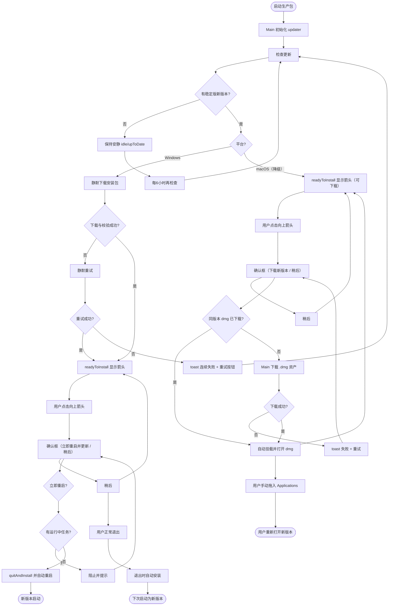
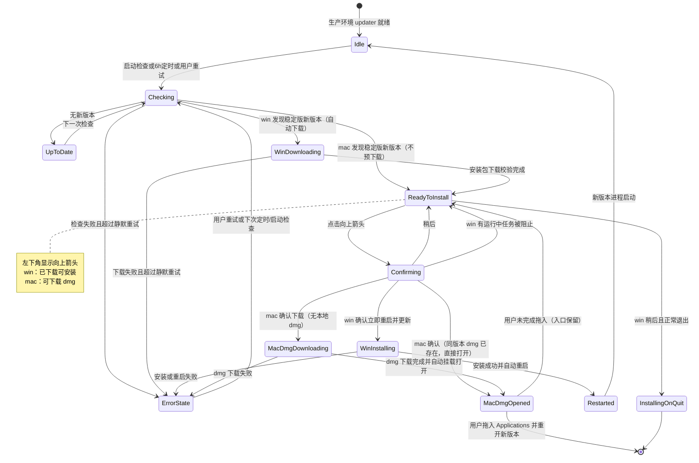

# PRD: HookBuddy 应用内自动更新

| 属性 | 值 |
|------|-----|
| 状态 | 工程：partial（见文末「工程验收状态」） |
| 范围 | Main 更新编排 + Preload IPC + Renderer 左下角入口与确认框；Windows 完整自动更新；macOS 降级（下载 dmg 手动安装）；App ID 固定为 `com.huyuan.hybuddy` |
| 关联文档 | `AGENTS.md`、`docs/build-and-release.md`、`docs/doc_index.md`、`electron-builder.yml`、`.github/workflows/build-all-platforms.yml` |
| 关联 PRD | `specs/prds/prd-00001-main-shell-ui.md`（侧栏左下角「设置」旁绿色圆圈占位） |

## 1. 背景与问题

HookBuddy 已基于 `electron-updater` 接入 GitHub Releases 更新源（见 `docs/build-and-release.md`）：生产环境启动时调用 `checkForUpdatesAndNotify()`，发现新版本后可后台下载，完成后依赖**系统通知**，用户退出时安装。

当前缺口：

1. **无应用内可见入口**：侧栏左下角「设置」旁绿色圆圈仅为头像/徽标占位（`prd-00001` R0），用户无法感知「更新已就绪」。
2. **无可控重启安装路径**：用户不能在工作间隙主动「重启并更新」；与 Codex/常见桌面客户端「下载完 → 箭头 → 确认重启」心智不一致。
3. **状态未打通三层进程**：更新逻辑仅在 Main 内调用，Preload/Renderer 无类型化 IPC，无法渲染状态或触发 `quitAndInstall`。
4. **macOS 自动安装受阻**：`electron-builder.yml` 当前 `identity: null`、`notarize: false`；未签名 app 无法走 `electron-updater` 的静默安装管线（`quitAndInstall` 会失败，其下载的 `-mac.zip` 亦做签名校验）。**当前拿不到 mac 签名密钥**，故本期 mac 端采用降级方案：检测新版本 → 点箭头**下载 dmg** → 自动打开 dmg 由用户手动拖入 Applications；签名/公证转入开放项，就绪后切回静默自动更新。
5. **应用标识仍为脚手架默认值**：`appId` 当前是 `com.electron.app`，须在首个正式发布前改为 `com.huyuan.hybuddy` 并从此固定，避免破坏后续安装与自动更新的身份连续性。

**价值假设**：让持续使用桌面客户端的开发者在不打断当前任务的前提下完成升级；「有更新 → 静默/后台获取 → 可点击入口 → 确认安装 → 回到新版本」形成可见、可控闭环，提高新版本覆盖率。

## 2. 目标与非目标

### 2.1 目标（Release 0）

**两平台共同行为**

- 生产环境：**启动时检查**更新，并在应用持续运行期间 **每 6 小时**复查一次。
- 仅接收 **正式稳定版** GitHub Release（忽略 draft / prerelease）。
- 就绪后将侧栏「设置」旁绿色圆圈替换为 **可点击的向上箭头**；tooltip 展示目标版本。
- 检查/下载失败：**首次静默记录并自动重试**；连续失败后 toast，并提供「重试」。
- Main 为唯一更新状态源；经 Preload 白名单暴露状态订阅与安装命令；遵守 `contextIsolation`。
- `appId` 改为 **`com.huyuan.hybuddy`** 并自首个正式发布起固定不变。

**Windows（完整自动更新）**

- 发现新版本后 **后台静默下载**（不打断主界面；下载过程不展示进度条入口）；下载校验完成后显示箭头。
- 点击箭头弹出确认：「**立即重启并更新**」/「**稍后**」。
  - 立即：退出 → 安装 → **自动重启**进入新版本。
  - 稍后：关闭确认框，**保留箭头入口**；用户之后**正常退出**时自动安装，下次启动即为新版本。
- 存在**运行中任务**时，阻止「立即重启并更新」并说明原因。

**macOS（无签名密钥期间的降级方案）**

- **检测到**稳定版新版本即显示箭头（不预先静默下载安装包）。
- 点击箭头弹出确认：「**下载新版本**」/「**稍后**」；确认后 Main **直接下载该 Release 的 `.dmg` 资产**（不经 electron-updater 安装管线）。
- 下载完成后 **自动挂载并打开 dmg**，弹出拖入 Applications 的安装窗口，用户手动拖入完成更新。
- **不静默安装、不自动重启**；文案不出现「重启」字样，明确提示「下载后需手动拖入 Applications」。
- 待签名/公证密钥就绪后（开放项 O4），切回与 Windows 一致的静默自动更新并移除本降级路径。

### 2.2 非目标

- Linux（AppImage 等）应用内自动更新 UI/闭环（可另立 PRD）。
- macOS **静默安装与自动重启**（受限于签名密钥未就绪；本期降级为下载 dmg 手动安装，切回条件见 O4）。
- 强制更新 / 不可跳过的安全补丁通道。
- 多通道（stable/beta）、灰度、回滚 UI。
- 下载进度条、速度/剩余时间、release notes 展示。
- 设置页「手动检查更新」完整设置页（本期仅失败 toast 上的重试即可）。
- 更新成功后的欢迎页 / 版本变更弹窗。
- 会话/草稿自动保存与更新后恢复（仅阻断运行中任务；草稿由确认文案提示用户）。
- Renderer 自定义更新 URL、绕过 Preload 直接调用 Node API。
- 改动 `checkForUpdatesAndNotify` 依赖的系统通知为唯一 UX（本期以应用内入口为主；可关闭或弱化系统通知噪音，实现时二选一并在验收说明）。

## 3. 术语

| 术语 | 含义 |
|------|------|
| 更新源 | GitHub Releases（`electron-builder.yml` → `publish.provider: github`，仓库 `0x00pluto/huyuan-hookbuddy`） |
| 静默下载 | （Windows）发现新版本后自动下载，不弹进度 UI，不打断当前工作 |
| Ready 入口 | 左下角向上箭头；Windows 表示「已下载，可安装」，macOS 降级下表示「有新版本，可下载 dmg」 |
| 立即重启并更新 | （Windows）调用 updater 退出并安装，且安装后自动重新启动应用 |
| mac 降级安装 | （macOS）点击箭头后 Main 下载 Release 的 `.dmg` 资产，完成后自动挂载打开，由用户手动拖入 Applications |
| 稍后 | 不立即安装/下载；保留 Ready 入口；Windows 在 `autoInstallOnAppQuit` 语义下正常退出时安装 |
| 运行中任务 | 本期定义：存在由主进程/Agent 编排的**进行中执行任务**（非仅 Composer 草稿）。若 R0 尚无真实 Agent 任务状态，工程须提供可查询的「是否有运行中任务」接口（可为 false stub），接口形态在实现时固定 |
| 稳定版 | 非 draft、非 GitHub prerelease 标记的正式 Release；`allowPrerelease = false` |

## 4. 已拍板规则 / 取舍

| 决策项 | 结论 | 备注 |
|--------|------|------|
| 功能 slug | `auto-update` | 文件 `prd-00002-auto-update.md` |
| 平台范围 | Windows + macOS 同属 R0 | Windows 完整自动更新；macOS 降级（下载 dmg 手动安装）；Linux 进非目标 |
| macOS 签名/公证 | 本期**拿不到密钥**，降级为开放项 O4 | 未签名不得走 electron-updater 安装管线；密钥就绪后切回静默自动更新 |
| App ID | 改为 `com.huyuan.hybuddy` | 首个正式发布前固定，此后不得变更（安装与更新身份连续性） |
| 入口位置 | 侧栏左下角，「设置」按钮右侧 | 替换现有绿色圆圈占位 |
| 入口显隐 | **仅** `readyToInstall`（win：已下载 / mac：检测到新版）时显示向上箭头 | 检查中/下载中保持原占位或隐藏箭头（不显示进度入口） |
| 检查频率 | 启动 + 每 6 小时 | 仅生产/打包态；开发模式不检查 |
| 发布渠道 | 仅稳定版 | `allowPrerelease = false`；忽略 draft |
| 确认框 | 双按钮确认框 | win：「立即重启并更新 / 稍后」；mac：「下载新版本 / 稍后」 |
| mac 下载完成动作 | 自动挂载并打开 dmg | 弹出拖入 Applications 窗口，用户手动完成；不静默安装、不自动重启 |
| 稍后 + 退出（win） | 正常退出（exit code 0）时自动安装 | 对齐 `autoInstallOnAppQuit` 默认行为 |
| 运行中任务 | 有任务则阻止 win 立即重启 | 文案说明需先结束任务；mac 降级路径不重启，不受此约束 |
| 失败反馈 | 首次静默重试；连续失败 toast + 重试 | 不每次失败打扰 |
| 更新/下载 URL | 仅 Main 依配置的 GitHub 源解析 | Renderer 不得传入下载地址；mac dmg 地址亦由 Main 解析 |
| 依赖库 | 继续使用已有 `electron-updater` | win 走完整管线；mac 仅复用其检查能力（或 GitHub latest release API），不引入第二套更新框架 |

## 5. 用户与角色

| 角色 | 目标 |
|------|------|
| 开发者用户（主） | 无感下载、可控重启、不丢进行中工作 |
| 内测/测试用户 | 可复现「有更新 / 已就绪 / 安装 / 失败重试」路径 |
| 发布维护者 | Release 资产（`latest*.yml`、安装包、blockmap）完整可被客户端消费 |
| 安全/发布管理员 | macOS 证书与公证密钥安全；签名身份稳定 |
| 前端/主进程工程师 | 按 IPC 白名单与状态机实现，可对照验收 |
| 产品/工程验收官 | 对照本 PRD 故事与状态图逐项验收 |

## 6. 功能域

实现落点（与 `AGENTS.md` 对齐）：

| 层 | 落点 | 职责 |
|----|------|------|
| Main | `src/main/`（建议抽 `updater` 模块，避免全堆在 `index.ts`） | 唯一订阅 `autoUpdater` 事件；维护状态；定时检查；按 `process.platform` 分派安装动作（win：`quitAndInstall`；darwin：下载 `.dmg` 并 `shell.openPath` 打开）；向窗口 `webContents.send` |
| Preload | `src/preload/index.ts` + `index.d.ts` | 白名单：`getUpdateStatus` / `onUpdateStatus` / `retryUpdateCheck` / `installUpdate`（win 重启安装 / mac 下载并打开 dmg，语义由 Main 分派）等（命名以实现为准，须类型化） |
| Renderer | `src/renderer/src/components/shell/`（Sidebar 入口 + 确认 Dialog） | 仅消费状态；按平台渲染箭头与确认文案；win 路径查询「运行中任务」后决定是否允许立即重启 |
| 发布 | `electron-builder.yml`、`.github/workflows/build-all-platforms.yml`、`docs/build-and-release.md` | `appId` 改 `com.huyuan.hybuddy`；保留 `latest*.yml`、`.dmg` 与 blockmap 资产；文档同步；mac 签名/公证待密钥（O4） |

### 6.1 更新状态模型（Main 权威）

| 状态 | 含义（win / mac 降级） | UI |
|------|------|-----|
| `idle` | 未在检查或已就绪路径之外的安静态 | 左下角保持占位圆圈（无箭头） |
| `checking` | 正在检查 | 同上，不打扰 |
| `upToDate` | 已是最新 | 同上 |
| `downloading` | win：发现新版本，静默下载安装包中；mac：用户确认后正在下载 `.dmg` | 同上（**不**显示进度入口）；mac 可在确认框内提示「正在下载」 |
| `readyToInstall` | win：安装包已下载可安装；mac：已检测到新版本，可下载 dmg | **向上箭头** + tooltip（目标版本） |
| `installing` | win：确认后正在退出安装；mac：dmg 下载完成正在打开 | win 随后进程退出；mac 打开 dmg 后回到 `readyToInstall`（用户可能未完成拖入） |
| `error` | 检查/下载/打开失败（连续失败后才对用户可见） | toast + 重试；左下角可不显示箭头 |

状态载荷建议至少包含：`status`、`platformFlow`（`win-auto` / `mac-dmg`）、`currentVersion`、`availableVersion?`、`errorMessage?`、`lastCheckedAt?`。

### 6.2 左下角入口规格

- 位置：侧栏底部「设置」右侧（替换 `Sidebar.tsx` 中 `aria-hidden` 绿色圆圈）。
- `readyToInstall`：lucide `ArrowUp`（或等价向上箭头），可点击；`aria-label` 按平台区分（win：「重启并安装更新」类；mac：「下载新版本」类）；tooltip 示例：win「新版本 vX.Y.Z 已就绪」/ mac「发现新版本 vX.Y.Z，点击下载」。
- 非 Ready：恢复圆圈占位或空位，**不可**误触发安装。
- 侧栏折叠：若侧栏收起导致入口不可见，须在标题栏区或折叠轨提供**同等 Ready 入口**（二选一实现时固定一种，禁止断头路）。默认推荐：侧栏折叠时在标题栏右侧显示同态箭头。

### 6.3 确认框规格

**Windows**

- 标题示例：「安装更新并重启？」
- 正文示例：说明将关闭应用并安装 `vX.Y.Z`；提示若有未发送草稿请先保存/发送。
- 主按钮：「立即重启并更新」；次按钮：「稍后」。
- 有运行中任务时：主按钮 `disabled` 或点击后 toast「请先结束当前任务」；不可进入 `installing`。
- 「稍后」：关闭对话框，状态仍为 `readyToInstall`。

**macOS（降级）**

- 标题示例：「下载新版本？」
- 正文示例：说明将下载 `vX.Y.Z` 的安装包（dmg），完成后会自动打开，需手动将应用拖入 Applications 完成更新；**不出现「重启」字样**。
- 主按钮：「下载新版本」；次按钮：「稍后」。
- 确认后进入 `downloading`（dmg）；完成后自动挂载打开 dmg；打开后状态回到 `readyToInstall`（用户可再次打开已下载的 dmg，无需重复下载）。
- 「稍后」：关闭对话框，状态仍为 `readyToInstall`。

### 6.4 检查与下载策略

- `is.dev` / 未打包：不发起真实更新检查。
- `allowPrerelease = false`。
- 启动后检查一次；之后 `setInterval` 或等价调度每 **6 小时**检查（应用退出时清理）。
- **Windows**：`autoDownload = true`（检测到即静默下载安装包）。
- **macOS（降级）**：`autoDownload = false`（仅检测，不预下载）；用户确认后由 Main 依配置的 GitHub 源解析并下载对应版本的 `.dmg` 资产（Renderer 不传 URL）；检测可复用 electron-updater 的 check 或 GitHub latest release API。
- 已处于 `downloading` / `readyToInstall` / `installing` 时，定时检查应跳过或幂等，避免重复下载与重复弹层。
- 失败：内部退避重试（实现自定次数，建议 ≥1 次静默重试）；仍失败则进入用户可见 `error` 并 toast。

### 6.5 安装与退出

**Windows**

- 「立即重启并更新」：`quitAndInstall`（静默参数以实现平台为准），**强制安装后重新运行**（`isForceRunAfter` 语义为 true）。
- 「稍后」后用户正常退出：保持 `autoInstallOnAppQuit = true`，exit code 0 时自动安装；下次启动为新版本，箭头消失。
- 非 0 退出码：不自动安装（对齐 electron-updater 行为）；状态可在下次启动重新检查。

**macOS（降级）**

- dmg 下载到用户可访问目录（如「下载」或应用缓存目录，实现时固定并写入验收）；完成后经 `shell.openPath` 等自动挂载打开。
- 应用**不退出、不重启**；用户手动拖入 Applications 后自行重新打开新版本。
- 同版本 dmg 已下载时，再次确认直接打开本地文件，不重复下载（可校验文件存在与大小/哈希）。
- 退出应用不触发任何 mac 自动安装行为。

### 6.6 安全边界

- 禁止 `nodeIntegration`；禁止把 `autoUpdater` 或任意 URL 下载能力暴露给 Renderer。
- IPC 仅传递状态快照与无参/受控命令；校验参数类型。
- 不在日志中打印发布证书口令、Apple 专用密码、GH token。

### 6.7 发布前置

- **App ID**：`electron-builder.yml` 的 `appId` 由 `com.electron.app` 改为 **`com.huyuan.hybuddy`**，随本 PRD 首个正式发布固定，此后不得变更（否则破坏安装与自动更新身份连续性）。Windows/macOS 构建产物均须使用该标识。
- **Release 资产**：必须包含各平台安装包（`.exe`、`.dmg`）、`latest.yml` / `latest-mac.yml`、`.blockmap`（若产出）；**禁止**删除更新元数据资产。mac 降级路径依赖 `.dmg` 资产存在且命名可由版本推导（当前 `${name}-${version}.dmg`）。
- **macOS 签名/公证（暂缓，O4）**：本期无签名密钥，维持 `identity: null` / `notarize: false`；未签名 dmg 首次打开需用户在 Gatekeeper 放行（右键打开或系统设置允许），该提示写入 mac 降级确认文案或文档。密钥就绪后：CI 注入证书与公证凭据、覆盖 `CSC_IDENTITY_AUTO_DISCOVERY: false`，并将 mac 切回静默自动更新。

## 7. 用户故事地图与版本切片

### 7.1 旅程主干

| 步骤 | 节点 | 说明 |
|------|------|------|
| Entry | 启动已安装生产包 | 进入 Main Shell；Main 初始化 updater |
| 1 | 检查更新 | 启动检查；无更新则安静 |
| 2 | 发现新版本 | win：进入静默下载；mac：直接进入就绪态；用户继续工作 |
| 3 | 就绪 | 左下角变为向上箭头（win：已下载 / mac：可下载） |
| 4 | 点击箭头 | 打开确认框（win：重启安装 / mac：下载 dmg） |
| 5a | win 立即重启 | 无运行中任务 → 安装并自动重启 → 新版本 |
| 5b | mac 确认下载 | 下载 dmg → 自动打开 → 用户手动拖入 Applications → 重新打开新版本 |
| 5c | 稍后 | 关闭框，箭头保留 |
| 6 | 稍后路径退出（win） | 正常退出自动安装；下次启动新版本 |
| 7 | 异常路径 | 连续失败 toast + 重试；win 有任务时阻止立即安装 |
| Exit / Teardown | 进程退出或新版本就绪 | 定时器清理；旧窗口销毁 |

### 7.2 用户故事地图

**阶段 A — 发现与静默下载**

| 故事 | 验收要点 |
|------|----------|
| 作为用户，我想要应用自动检查更新，以便无需手动找安装包 | 生产启动会检查；运行满 6 小时会再次检查；开发模式不检查 |
| 作为用户，我想要只收到正式版，以便避免误升测试包 | prerelease/draft 不被选为最新可更新版本 |
| 作为 Windows 用户，我想要新版本在后台下载，以便不打断当前工作 | `update-available` 后自动下载；下载中不弹进度入口、不强制打断 |
| 作为 mac 用户，我想要发现新版本时不被抢占带宽或磁盘，以便由我决定何时下载 | mac 检测到新版仅亮箭头，不预下载安装包 |

**阶段 B — 就绪入口与确认**

| 故事 | 验收要点 |
|------|----------|
| 作为用户，我想要在就绪后看到左下角向上箭头，以便知道可以升级 | 仅 `readyToInstall` 显示箭头；tooltip 含目标版本且按平台区分文案 |
| 作为用户，我想要点击箭头后选择确认或稍后，以便控制升级时机 | 确认框双按钮（win：重启安装 / mac：下载）；稍后关闭后箭头仍在 |
| 作为 Windows 用户，我想要立即安装后应用自动回来，以便少一步手动打开 | 确认后退出安装且自动重新启动；版本号变为新版本 |
| 作为 Windows 用户，我想要有任务运行时不被强行重启，以便保护进行中工作 | 有运行中任务时无法进入安装；有明确提示 |
| 作为 mac 用户，我想要确认后自动下载并打开 dmg，以便照提示拖入即可完成更新 | 确认后下载 `.dmg`；完成后自动挂载打开安装窗口；全程无自动重启 |
| 作为 mac 用户，我想要重复点击不重复下载，以便节省流量 | 同版本 dmg 已存在时直接打开本地文件 |

**阶段 C — 退出安装与失败恢复**

| 故事 | 验收要点 |
|------|----------|
| 作为 Windows 用户，我想要选稍后后再正常退出也能装上更新，以便不丢已下载包 | 稍后 + 正常退出后，下次启动为新版本 |
| 作为用户，我想要更新失败时能重试，以便网络抖动可恢复 | 连续失败 toast 含重试；重试可再次进入检查/下载 |
| 作为 mac 用户，我想要 dmg 下载失败后能再试，以便完成升级 | mac 下载失败进入 `error`，toast 重试可重新下载 |

**阶段 D — 发布与平台**

| 故事 | 验收要点 |
|------|----------|
| 作为发布维护者，我想要 Win 包可被自动更新链消费、mac 包可被降级链下载，以便用户真正升上去 | Release 含 yml/blockmap/`.exe`/`.dmg`；win 走通 Ready→安装重启；mac 走通 Ready→下载→打开 dmg |
| 作为发布维护者，我想要应用标识固定为 `com.huyuan.hybuddy`，以便版本间身份连续 | Win/mac 构建产物 `appId` 均为 `com.huyuan.hybuddy`，首个正式发布后不再变更 |
| 作为工程师，我想要更新只经 Preload 白名单，以便不破坏 IPC 安全边界 | Renderer 无 Node 更新 API；dts 与实现一致 |

### 7.3 Release 切片

#### Release 0（MVP，必选）

- Main updater 状态机 + 启动/6h 检查 + 稳定版过滤 + 平台分派（win-auto / mac-dmg）。
- Windows：静默下载 + 确认框（立即重启/稍后）+ 运行中任务阻断 + 稍后正常退出自动安装 + 立即路径自动重启。
- macOS 降级：检测即亮箭头 + 确认框（下载/稍后）+ 下载 `.dmg` + 完成后自动打开 + 同版本不重复下载。
- Preload 类型化 IPC（状态读/订阅、重试、安装/下载命令）。
- Sidebar 左下角 Ready 箭头（分平台 tooltip/文案）。
- 失败静默重试 + 连续失败 toast（两平台）。
- `appId` 改为 `com.huyuan.hybuddy` 并随首个正式发布固定。
- 文档：`docs/build-and-release.md` 更新「应用内入口」、mac 降级说明与 Gatekeeper 放行提示。

**可验收结果**：在已发布的旧版本客户端上，推送更高版本稳定 Release 后——Windows 可完整走通「静默下载 → 箭头 → 确认重启 → 新版本启动」，稍后路径退出后再开为新版本；macOS 可完整走通「检测 → 箭头 → 确认下载 dmg → 自动打开 → 手动拖入 → 重开为新版本」；两端产物 `appId` 均为 `com.huyuan.hybuddy`。

#### Release 1（可选，同 PRD）

- **macOS 切回静默自动更新**：签名/公证密钥就绪后（O4），CI 接入证书与公证，mac 与 Windows 同等闭环，移除 dmg 降级路径。
- 侧栏折叠时标题栏 Ready 入口的视觉打磨（若 R0 已用最小可用方案）。
- 设置页「检查更新」与当前版本展示。
- 弱化/关闭系统通知，统一为应用内 UX。
- 更细的错误分类文案（网络 / 磁盘 / 签名校验）。

**本期不做（禁止 Release 2 占位）**：见 §2.2；Linux 自动更新、强制升级、多通道等另立 PRD。

## 8. 核心流程与状态机图

### 8.1 主业务流程图

### 8.2 核心对象状态图

**断头路预警**

- 侧栏折叠后无任何 Ready 入口 → 禁止；须有折叠态替代入口。
- 「稍后」后箭头消失且无法再安装/下载（又未退出）→ 禁止；必须保留 `readyToInstall`。
- 仅系统通知、应用内无入口 → 不满足本 PRD 主路径。
- mac 未签名却走 electron-updater 静默安装管线 → 禁止；降级期间只允许「下载 dmg + 打开」路径。
- mac dmg 打开后用户未拖入即关闭 → 入口必须保留，可再次打开本地 dmg，不得要求重复下载。
- 下载失败永久卡死无法重试 → 禁止。

## 9. 数据与 API 衔接

| 项 | 说明 |
|----|------|
| 远程元数据 | GitHub Release 的 `latest.yml` / `latest-mac.yml` + 安装包（`.exe` / `.dmg`）+ blockmap |
| mac dmg 资产 | 命名 `${name}-${version}.dmg`（现配置）；由 Main 依版本号解析下载地址，Renderer 不传 URL |
| 本地状态 | Main 内存状态机；不强制持久化「稍后」标记（win 退出即装）；mac 已下载 dmg 的本地路径可记录以避免重复下载 |
| IPC（示意） | `updater:get-status`、`updater:status`（push）、`updater:retry`、`updater:install`（win 重启安装 / mac 下载并打开 dmg，Main 按平台分派） |
| 运行中任务 | Renderer 或 Main 提供只读查询；R0 可 stub 为 false，但接口必须存在且可测（仅 win 立即安装路径消费） |
| 版本号 | 以 `package.json` / 应用 `app.getVersion()` 与 Release tag 一致为准（CI 已有 tag 校验） |
| 应用标识 | `appId = com.huyuan.hybuddy`（`electron-builder.yml`），首个正式发布后固定 |

## 10. 成功标准（可度量）

1. Windows 主路径（静默下载 → 箭头 → 立即重启 → 新版本）可演示走通。
2. macOS 降级路径（检测 → 箭头 → 确认下载 dmg → 自动打开 → 手动拖入 → 重开新版本）可演示走通；全程无静默安装、无自动重启。
3. 检查/下载过程中主 Shell 可正常使用；无强制打断弹窗（确认框仅用户点击箭头后出现）。
4. 非 `readyToInstall` 时不出现可点击安装/下载箭头。
5. 「稍后」后入口仍可打开确认框；win 正常退出后下次启动版本号递增。
6. prerelease-only 最新包时，稳定版客户端不进入 Ready。
7. 连续失败可见 toast，且重试可再次触发检查/下载；mac 同版本 dmg 不重复下载。
8. win 有运行中任务时立即安装成功率为 0（被阻断）。
9. `pnpm typecheck` 通过；Preload dts 与暴露 API 一致。
10. 发布产物：Win/mac `appId` 均为 `com.huyuan.hybuddy`；Release 含 `.exe`、`.dmg`、`latest*.yml`、blockmap。

## 11. 假设与待确认 / 开放项

| 编号 | 内容 | 状态 |
|------|------|------|
| O1 | 「运行中任务」在 Agent 落地前的 stub 策略与后续真实信号来源 | 待与工程对齐；R0 允许 stub，但阻断逻辑代码路径须可测 |
| O2 | 侧栏折叠时 Ready 入口的最终视觉位置（标题栏 vs 图标轨） | 实现时固定一种并写入验收 |
| O3 | 是否保留/关闭 `checkForUpdatesAndNotify` 的系统通知 | 默认倾向关闭或降噪，以应用内入口为准；待实现确认 |
| O4 | Apple 开发者证书、公证账号、CI Secrets 就绪时间 | 不再阻塞 R0（mac 已降级为 dmg 手动安装）；就绪后按 R1 切回 mac 静默自动更新并移除降级路径 |
| O8 | mac dmg 下载目录（「下载」vs 应用缓存）与本地文件校验方式（存在/大小/哈希） | 实现时固定并写入验收 |
| O9 | 未签名 dmg 的 Gatekeeper 放行提示放在确认框文案还是文档/FAQ | 实现时固定一种 |
| O5 | 私有仓库 Release 是否需要 GitHub token 供 updater 拉取 | 若仓库私有须配置；公开则默认即可 |
| O6 | 确认框组件用 shadcn Dialog 或 AlertDialog | 实现选型，不影响产品语义 |
| O7 | 与 `prd-00001` 设置页占位的关系 | 本期不实现设置页更新项；设置点击仍可为 WIP toast |

## 12. 风险与缓解

| 风险 | 缓解 |
|------|------|
| mac 误走 electron-updater 安装管线（未签名必失败） | Main 按平台硬分派；mac 禁用 `autoDownload` 与 `quitAndInstall` 路径；验收含此断言 |
| 未签名 dmg 被 Gatekeeper 拦截，用户不会放行 | 确认文案或文档给出右键打开/系统设置放行指引（O9） |
| mac 用户拖入时新旧版本混淆或应用正在运行导致替换失败 | dmg 打开前后提示先退出旧版本再拖入；文档说明 |
| GitHub API 限流 / 网络失败 | 静默重试 + 6h 再检；连续失败才打扰 |
| 用户误点立即重启丢草稿（win） | 确认文案提示；运行中任务硬阻断 |
| 重复注册 updater 监听导致多次下载/多次弹层 | Main 单例状态源；幂等检查 |
| Release 删掉 yml/blockmap/dmg | 发布检查清单 + `docs/build-and-release.md` 强调 |
| `appId` 变更破坏更新身份连续性 | 本 PRD 一次性改为 `com.huyuan.hybuddy` 并随首个正式发布固定；此后变更须单独评审 |
| dmg 资产命名模板变更导致 mac 下载地址解析失败 | 命名模板（`${name}-${version}.dmg`）纳入发布检查；变更需同步更新解析逻辑 |

## 13. 依赖

- 已有依赖：`electron-updater`（`package.json`）。
- 发布依赖：GitHub Releases 产物完整（含 `.dmg` 资产与更新元数据）。
- R1 切回 mac 静默更新的依赖：Apple 证书与公证 Secrets（O4）。
- 产品依赖：`prd-00001` Main Shell 侧栏底部布局已存在。

## 14. 修订记录

| 日期 | 说明 |
|------|------|
| 2026-07-21 | 初稿：基于头脑风暴与已拍板决策落盘（Win+mac、静默下载、左下角箭头、确认重启、稍后退出安装、任务阻断、稳定版、失败静默重试） |
| 2026-07-21 | 修订：`appId` 拍板改为 `com.huyuan.hybuddy` 并随首个正式发布固定；因 mac 签名密钥不可得，macOS 降级为「检测亮箭头 → 确认下载 dmg → 自动打开 → 手动拖入」，签名/公证转开放项 O4，切回静默更新列入 R1 |

## 15. 工程验收状态

> 由 `/team:prd-accept` 维护；勿手工编造「通过」。最后更新：2026-07-21T09:00:49Z，main@951f86a，范围：R0,R1。

### 总览

| 项 | 值 |
|----|-----|
| 工程状态 | `partial` |
| 验收判定 | 部分通过 |
| 最近验收 | 2026-07-21T09:00:49Z |
| 代码提交 | `951f86a`（`v1.0.4`） |
| 摘要 | R0 代码路径已合入：Main 状态机、Preload IPC、侧栏/标题栏 Ready 入口、分平台确认框、`appId=com.huyuan.hybuddy`、文档已同步；dev 态 UI 验过「无更新不显示入口」。Win/mac 生产包端到端升级演示与 R1（mac 静默切回等）未完成。 |

### Release 交付

| Release | 状态 | 说明 |
|---------|------|------|
| R0 | 部分 | 实现与类型检查齐备；打包态端到端升级路径待人工/CI 产物复验 |
| R1 | 未实现 / 部分范围外 | 依赖 O4 的 mac 静默切回未做；设置页检查更新按 O7 本期不做；系统通知已在 R0 关闭 |

### 功能验收清单（Agent 优先读此表）

| ID | 能力摘要 | Release | 状态 | 证据 |
|----|----------|---------|------|------|
| F01 | Main updater 状态机 + 启动/6h 检查 + `allowPrerelease=false` + 平台分派 | R0 | 通过 | `src/main/updater.ts`（`CHECK_INTERVAL_MS`、`allowPrerelease=false`、`autoDownload=isWin`、`initUpdater`）；`src/main/index.ts:72` |
| F02 | Windows：静默下载 + 确认框立即/稍后 + `quitAndInstall(..., true)` + `autoInstallOnAppQuit` | R0 | 部分 | 代码：`updater.ts` `installWinUpdate` / `autoDownload` / `autoInstallOnAppQuit`；`UpdateEntry.tsx` win 文案。**缺**：旧客户端→新 Release 实机演示 |
| F03 | Windows：运行中任务阻断立即安装（stub 可测） | R0 | 通过 | `hasRunningTask()` stub + `tasks:has-running`；Main/`UpdateEntry` 双侧校验 |
| F04 | macOS 降级：检测即 Ready + 确认下载 dmg + `shell.openPath` + 同版本不重复下载 | R0 | 部分 | `installMacUpdate` / `isMacDmgReady` / `app.getPath('downloads')`；确认框含拖入 Applications。**缺**：打包态端到端演示 |
| F05 | Preload 类型化 IPC（get/on/retry/install/hasRunningTask） | R0 | 通过 | `src/preload/index.ts` + `index.d.ts` 与 Main handlers 一致 |
| F06 | Sidebar Ready 箭头 + 分平台 tooltip/确认文案；非 Ready 不占位 | R0 | 通过 | `UpdateEntry.tsx` `if (!isReady) return null`；`Sidebar.tsx`；dev UI CDP：无箭头/无占位圆圈 |
| F07 | 侧栏折叠时标题栏 Ready 入口（O2） | R0 | 通过 | `TitleBar.tsx` `{!sidebarOpen && <UpdateEntry variant="titlebar" />}` |
| F08 | 失败首次静默重试 + 连续失败 toast「重试」 | R0 | 通过 | `scheduleSilentRetry`；`useUpdateStatus.ts` sonner action |
| F09 | `appId` / AppUserModelId = `com.huyuan.hybuddy` | R0 | 通过 | `electron-builder.yml:1`；`src/main/index.ts:53` |
| F10 | 文档：应用内入口、mac 降级、Gatekeeper、系统通知关闭 | R0 | 通过 | `docs/build-and-release.md`「自动更新」节 |
| F11 | 关闭系统通知（O3），改用 `checkForUpdates` | R0 | 通过 | 无 `checkForUpdatesAndNotify`；文档注明已关闭 |
| F12 | `pnpm typecheck`；dts 与暴露 API 一致 | R0 | 通过 | typecheck exit 0（验收时） |
| F13 | Win/mac 生产主路径可演示走通（成功标准 1–2、5、10） | R0 | 部分 | 已发 `v1.0.4` tag；**缺**旧版客户端实机走通与 Release 资产人工确认（本环境 `gh` 未登录） |
| F14 | macOS 切回静默自动更新（去 dmg 降级） | R1 | 未实现 | 依赖开放项 O4（证书/公证未就绪） |
| F15 | 侧栏折叠 Ready 入口视觉打磨 | R1 | 未实现 | R0 已有最小可用标题栏入口；打磨未做 |
| F16 | 设置页「检查更新」与当前版本 | R1 | 范围外 | O7：本期不实现设置页更新项 |
| F17 | 更细错误分类文案 | R1 | 未实现 | 仅通用 errorMessage + toast |
| F18 | R1「弱化/关闭系统通知」 | R1 | 通过 | 已在 R0 关闭系统通知，统一应用内入口 |

### 未完成与遗留

1. **生产端到端**：用旧版安装包对 `v1.0.4+` 正式 Release，复验 Win 静默下载→重启、mac 下载 dmg→打开→拖入。
2. **R1 / O4**：Apple 签名与公证就绪后切回 mac 静默自动更新并移除 dmg 降级。
3. **R1**：设置页检查更新、错误分类文案、折叠入口视觉打磨（可选）。
4. 开放项 O1 stub 在 Agent 任务落地后需接真实运行中任务信号。

### 质量检查

| 检查项 | 状态 |
|--------|------|
| 自动化测试（本项目无） | 跳过 |
| pnpm typecheck | 通过（验收时） |
| pnpm lint（相关文件） | 通过（无新增 error；全仓历史 lint 债不计入本 PRD） |
| 文档与发布说明同步 | 通过（`docs/build-and-release.md`、`CHANGELOG` 1.0.4） |
| OpenAPI | 不适用（无 REST API） |

---
统计：通过 11 / 部分 3 / 未实现 3 / 范围外 1
